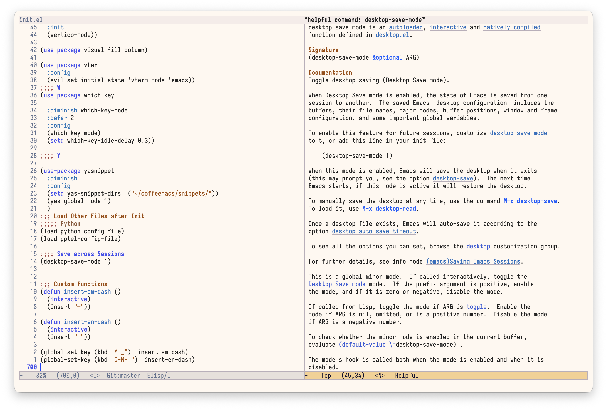
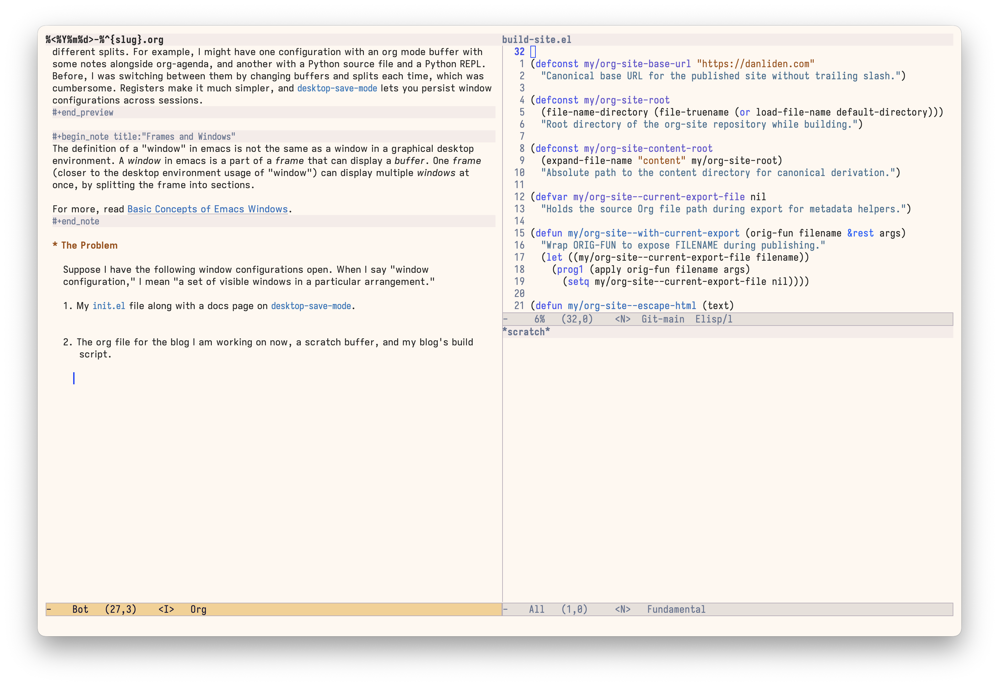
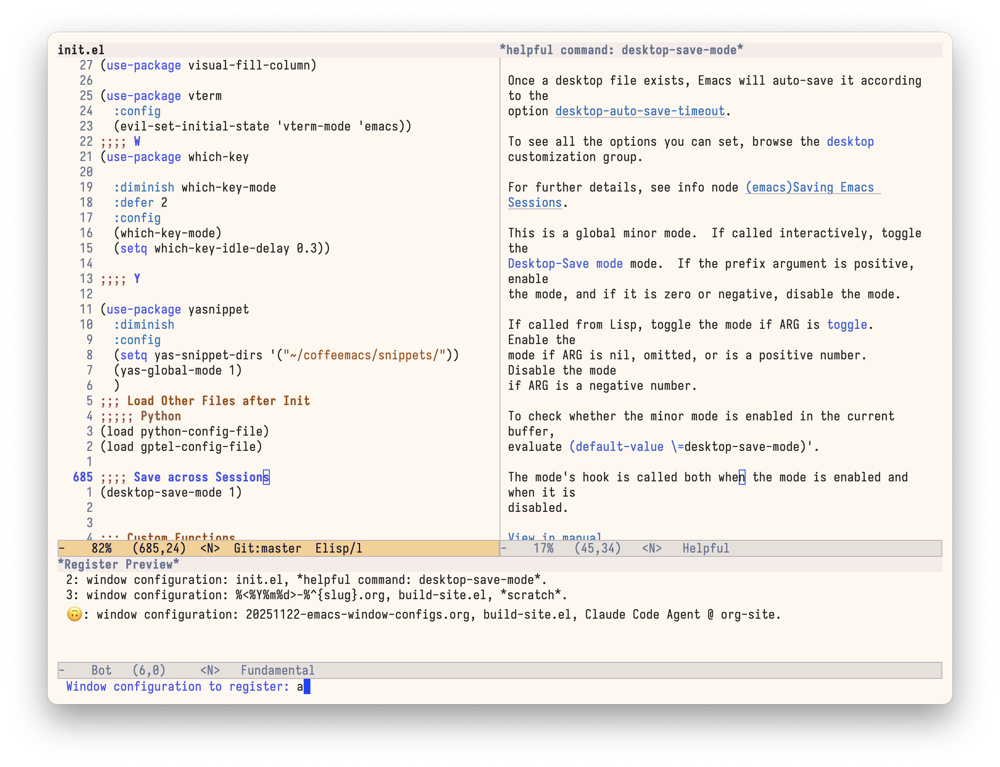
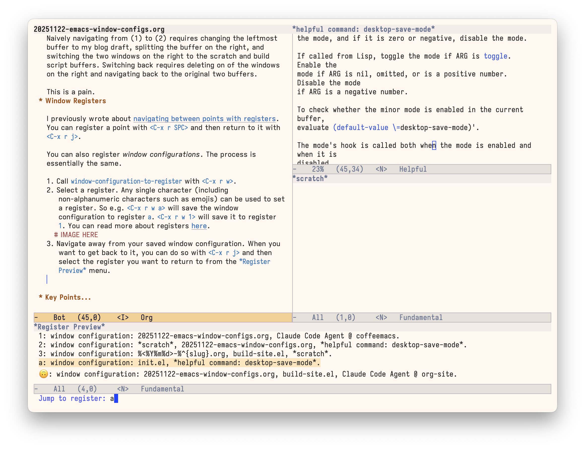
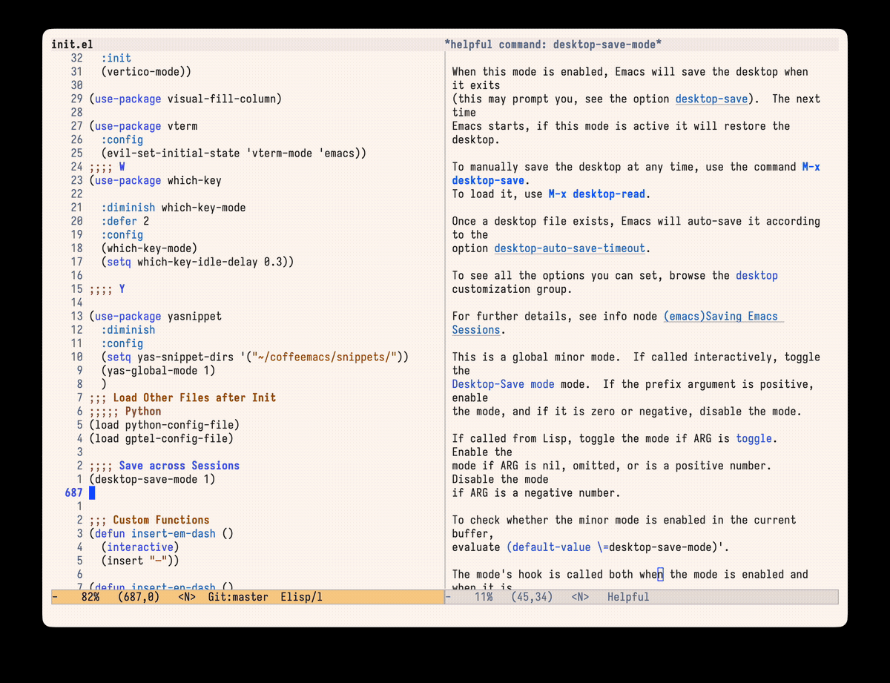
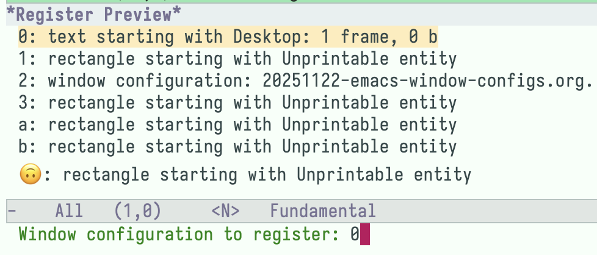

#+TITLE: Saving and Restoring Window Configurations in Emacs
#+DATE: <2025-11-22 Sat>
#+AUTHOR: Daniel Liden
#+DESCRIPTION: This post talks about registers and desktop-save-mode for restoring window configs in emacs.
#+KEYWORDS: emacs, org mode, gnu
#+IMAGE: /posts/figures/20251122-emacs-window-configs/social_preview.png

#+begin_preview
When working in emacs, I often switch between different combinations of windows with different splits. For example, I might have one configuration with an org mode buffer with some notes alongside org-agenda, and another with a Python source file and a Python REPL. Before, I was switching between them by changing buffers and splits each time, which was cumbersome. Registers make it much simpler, and ~desktop-save-mode~ lets you persist window configurations across sessions.
#+end_preview

#+begin_note title:"Frames and Windows"
The definition of a "window" in emacs is not the same as a window in a graphical desktop environment. A /window/ in emacs is a part of a /frame/ that can display a /buffer/. One /frame/ (closer to the desktop environment usage of "window") can display multiple /windows/ at once, by splitting the frame into sections.

For more, read [[https://www.gnu.org/software/emacs/manual/html_node/elisp/Basic-Windows.html][Basic Concepts of Emacs Windows]].
#+end_note

* The Problem

Suppose I have the following window configurations open. When I say "window configuration," I mean "a set of visible windows in a particular arrangement."

1. My ~init.el~ file along with a docs page on ~desktop-save-mode~.

   #+CAPTION: My init.el next to the desktop-save-mode docs
   
   
2. The org file for the blog I am working on now, a scratch buffer, and my blog's build script.

   #+CAPTION: Blog post on the left, scratch buffer and build script on the right
   

Naively navigating from (1) to (2) requires changing the leftmost buffer to my blog draft, splitting the buffer on the right, and switching the two windows on the right to the scratch and build script buffers. Switching back requires deleting on of the windows on the right and navigating back to the original two buffers.

This is a pain.
* Window Registers

I previously wrote about [[https://www.danliden.com/notes/20250308-registers-1.html][navigating between points with registers]]. You can register a point with ~<C-x r SPC>~ and then return to it with ~<C-x r j>~.

You can also register /window configurations/. The process is essentially the same.

1. Call ~window-configuration-to-register~ with ~<C-x r w>~.
2. Select a register. Any single character (including non-alphanumeric characters such as emojis) can be used to set a register. So e.g. ~<C-x r w a>~ will save the window configuration to register ~a~. ~<C-x r w 1>~ will save it to register ~1~. You can read more about registers [[https://www.gnu.org/software/emacs/manual/html_node/emacs/Registers.html][here]].

   #+CAPTION: Saving the current setup to a register
   

3. Navigate away from your saved window configuration. When you want to get back to it, you can do so with ~<C-x r j>~ and then select the register you want to return to from the ~*Register Preview*~ menu.

   #+CAPTION: Jumping back to a saved configuration from the Register Preview menu
   

   This will immediately return you to the window configuration you saved above.

Once we register a couple of different window configurations, it becomes very easy to swap between them!

#+CAPTION: Swapping between saved configurations
 
* Persisting across Sessions

Registers do not persist across emacs sessions—when you restart emacs, your registers are gone.

One approach to persisting the state of emacs across sessions is with [[https://www.gnu.org/software/emacs/manual/html_node/emacs/Saving-Emacs-Sessions.html#Saving-Emacs-Sessions][desktop-save-mode]], which saves a ~.emacs.desktop~ file to your ~user-emacs-directory~ (or whatever other location you specify), and then reads from this file when emacs is restarted or when you manually call ~desktop-read~.

In my limited testing, this approach is imperfect. Some buffers are not restored, and window registers seem to be saved in a corrupted and unusable form (even though ~register-alist~ is part of the ~desktop-globals-to-save~ list, which specifies what is preserved across sessions).

#+CAPTION: The saved window registers look a bit mangled

Still, it's better than nothing? I'm sure there are other solutions out there.

For me, this is not much of a problem. I don't often exit emacs.
* Try out window registers

It's simple:

1. ~<C-x r w>~ and then select the register (any single character)
2. Navigate away from your present window configuration
3. ~<C-x r j>~, choose the register to which you saved your configuration in (1)

   And you're back where you started!
