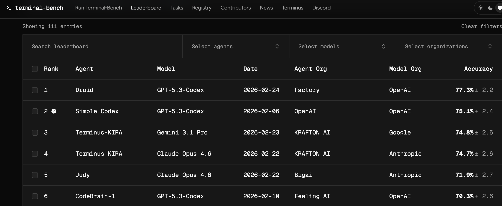
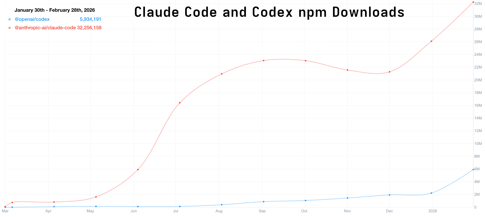
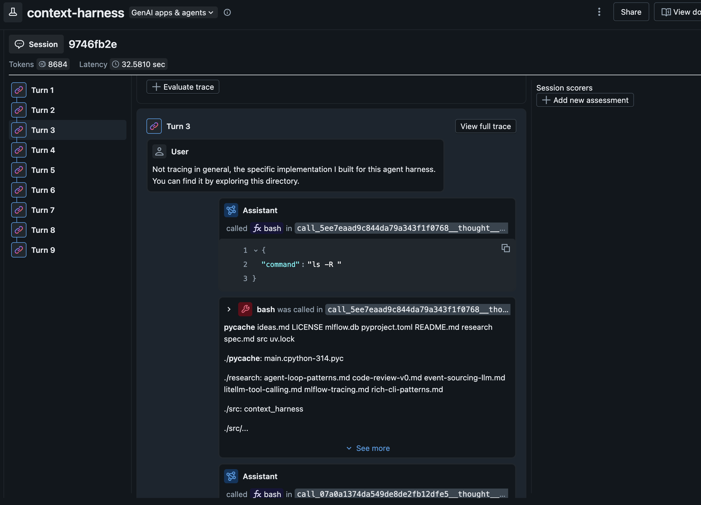

#+title:      Harness Engineering
#+date:       [2026-02-28 Sat 00:00]
#+identifier: 20260228T000000
#+AUTHOR: Daniel Liden
#+DESCRIPTION: This post introduces the concept of harness engineering and builds a simple agent harness
#+KEYWORDS: agent, ai, mlflow, claude code, harness
#+begin_preview
In the first couple of years of LLMs, we talked a lot about "prompt engineering": how to craft a /prompt/ just so in order to induce the LLM to do what we want. Since then, we've moved on to the more expansive "context engineering": how multiple available sources of context (chat history, file reads, web search results, etc.) should be combined to induce an agent to do what we want. Here, I'm writing about the even-more-expansive notion of "harness engineering": how do we orchestrate the whole loop of LLM invocations, tool calls, background process management, context retrieval, permission asks, etc., to get the agent to do what we want?
#+end_preview

#+COMMENT When syndicating elsewhere, add a canonical link like:
#+COMMENT #+CANONICAL_URL: https://danliden.com/posts/SLUG/
#+COMMENT Add #+IMAGE: /posts/figures/YYYYMMDD-slug/hero.png when you have a social card.

* Introduction

I have been using Claude Code and OpenAI Codex for months now. The underlying models clearly drive much of the effectiveness of these tools—the [[https://wtfhappened2025.com/][much commented-on]] jumps in performance over the past few months are clear demonstrations of the centrality of model performance.

But models frequently leapfrog each other in terms of performance (real or perceived). A new model comes out and tops leaderboards and benchmarks—but many developers tend to stick to, or adopt, a harness that enforces use of what might be considered a "lesser" model (though, at this point, we're splitting hairs. The top models are all incredibly capable).

Right now, Claude Opus 4.6, GPT Codex 5.3, and Gemini 3.1 Pro are vying for the top positions on the [[https://www.tbench.ai/leaderboard/terminal-bench/2.0][terminal bench 2 benchmark]], with some variations depending on the harnesses in which they are running.

#+CAPTION: Terminal-Bench leaderboard (February 2026). GPT-5.3-Codex holds the top spot; Claude Opus 4.6 slots in at #4—separated by a few percentage points from the leader.

Even though Codex 5.3 currently hold the top slot, the Claude Code coding agent harness is much more popular than the OpenAI harness. Compare their npm downloads, for example—an incomplete, but directionally correct datapoint.

#+CAPTION: npm downloads for @anthropic-ai/claude-code vs. @openai/codex. Claude Code's ~32M downloads are more than 5× Codex's ~6M.

All of this is to say: the harness is crucially important. The harness is more responsible for the user's experience of working with a given coding agent than the underlying intelligence is. It's /also/ much easier to modify and customize than the underlying model. More on that later. First: what is an agent harness?

In most of the articles I've read, the term "harness" is used but not defined. I use it very broadly. The harness is the loop in which the LLM is invoked and in which it interacts with user(s) and/or its environment.

A single API call to an LLM does not involve a harness, in this formulation. But even a simple chat loop constitutes a harness. Other features of a harness might include:
- tool calling (bash execution, web search, web fetch, etc.)
- context management (compaction, clearing, summarization, checkpointing, knowledge/discovery of tools, skills, etc.)
- instrumentation/observability (capturing traces, running automated evaluations)
- subprocess management: for when an agent launches long-running processes like web servers or subagents

You probably aren't in a position to build your own Claude Opus model. But you /can/ build your own harness. If nothing else, it will help you to understand what is possible and how much control you have over your agentic coding environment. Claude Code is great. I'm almost certainly going to keep using it. But having your own agent harness gives a great platform for experimenting with different patterns of context handling, tool use—all the stuff that isn't the underlying intelligence.

In the rest of this post, we'll make a simple extensible harness. This will be the foundation for some future experiments I have planned. More on that later.
* A simple harness

My goal here was to build a very simple but extensible agent harness. I started by sketching out what this means:

1. Simple control flow: it's just a loop.
2. Everything (human input, tool calls, tool responses, agent responses) is an explicit, understandable event
3. Simple defaults. I'm not doing anything clever at this phase.
4. Provider agnostic—don't anchor to a specific model/provider.
5. Observability is built in but non-blocking

The goals, at this phase, are interpretability and transparency. Optimization and experimentation will come later.

#+begin_note
I'm not going to show much in the way of code. Poke around [[https://github.com/djliden/context-harness][here]] if you're interested. I heavily used Claude Code and Codex to write the code (though this agent harness itself, powered by gemini-3-flash, contributed a little bit at the end!). So I'm focusing more on the high-level organization and the things I'm trying to accomplish.

I'm new to this! I'm used to writing technical articles with a lot of code. I'd love to hear your thoughts on what worked and what didn't in this format. I don't think anyone has the answer to the question of what makes good technical writing in the age of agentic coding.
#+end_note

** The core loop

The ~ChatLoop~ class is where everything happens. At its core, it's just a for loop. The user's message goes in; context is assembled from the chat history; the model is called; tools are executed if there were tool calls; tool results are returned to the model. Once there is a text result with no tool calls, that result is returned to the user. You can find the class [[https://github.com/djliden/context-harness/commit/eef51a8eccc1f7fbb1c57ca37d08572cfa5a1bc8#diff-4dffee8972ca12234622b36061093a0d0beed07e5ba0a507907ec84707325ab8R14][here]]. 
** The execution log

I wanted a durable "source of truth" event log. For this simple initial version, I opted for an append-only in-memory event log defined in the ~EventLog~ class ([[https://github.com/djliden/context-harness/commit/eef51a8eccc1f7fbb1c57ca37d08572cfa5a1bc8#diff-64a8fc12530c0d0b6ef710971e6d6fed48b333fe1b100b72b7e0f02ba3c29c3fR35][link]]). Each event—user messages, model calls, errors, etc.—is logged. This ~EventLog~ is used to construct the context at each turn and to simplify debugging.
** Build the context

One of the things I really want to explore about agent harnesses is the way context is constructed and sent to the model. In this case, context assembly is, intentionally, very simple: include everything, with no pruning or compaction. We can experiment more with this later ([[https://github.com/djliden/context-harness/commit/eef51a8eccc1f7fbb1c57ca37d08572cfa5a1bc8#diff-08ef332ff6f7d48abb605e670b4f550c07d70b86022f86e34151c99722edc76cR37][link]]).
** Add tool call support

Tools have a very minimal protocol: =name=, =description=, =parameters=, and async =execute()=. Then I added three tools that cover a pretty substantial proportion of what we ask agents to do: =bash=, =web_search=, =web_fetch=.

Again, no magic: a tool call was just structured input, a function execution, and a structured result logged back into the loop.
** LLM Support

Of course, the core of any agent is the intelligence powering it. I wanted this system to be model agnostic from the start. As we saw above, the "best model" for the job changes constantly.

I used the [[https://www.litellm.ai/][LiteLLM]] library to make this agent loop provider agnostic. Provider support is handled by the ~LiteLLMAdapter~ class ([[https://github.com/djliden/context-harness/commit/eef51a8eccc1f7fbb1c57ca37d08572cfa5a1bc8#diff-e6cb1529cf9b6a2fbf7de1ec96a54b35d5323e364de163515cd2a08d42fd888eR21][link]]). This is the only part of the code that should ever need to be concerned with the responses that come from particular providers. The rest of the harness only needs to worry about uniformly-formatted context, tool call and message formats, and the formatted usage record.
** Observability

Finally, I wired in tracing (=TraceLogger= + MLflow autologging) and usage logging. Importantly, this component will issue a warning without blocking the agent if there are e.g. errors with the tracking server.

Observability is important and I wanted to add it from the start. It should help me improve the system over time, but it should never become a runtime dependency for core behavior.

#+begin_tip
MLflow recently added the ability to group traces into *sessions* so you can evaluate the quality of entire conversations, not just inputs and outputs.

#+CAPTION: MLflow session view for the context-harness project, showing all turns of a conversation grouped into a single session with aggregate token and latency metrics.

#+end_tip

** Big picture
The result of all this is simple on purpose. At its core, the harness is a loop, a log, and a few translation layers. An "agent harness" is not some mystical thing. Especially with the help of /other/ agent harnesses, you can build one in an afternoon.

* What's next

This harness is enough of a foundation to start running some experiments on. We have the core loop. It's modular and customizable. The results are all traced in MLflow.
* Takeaways

You might feel like this post was a little thin. And you'd be right to feel that way. That's the point. Working with the major coding agents today can feel like petitioning a genie for help and hoping that its mystical machinations return what you need. What I hope I communicated is that agent harnesses can be very simple.

From here, we'll be doing some more experiments with features we can layer into our agent harness. I suspect, for example, that there are far better ways to handle context; that chat transcripts are extremely poor in terms of useful information density when working toward specific outcomes. I'll write about that, and some early experiments, next time.

