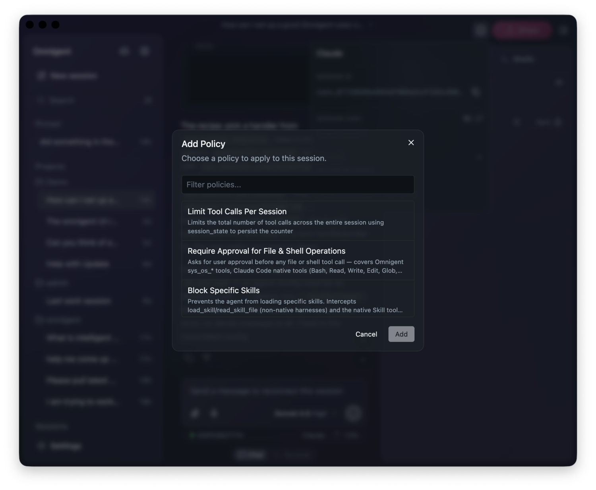
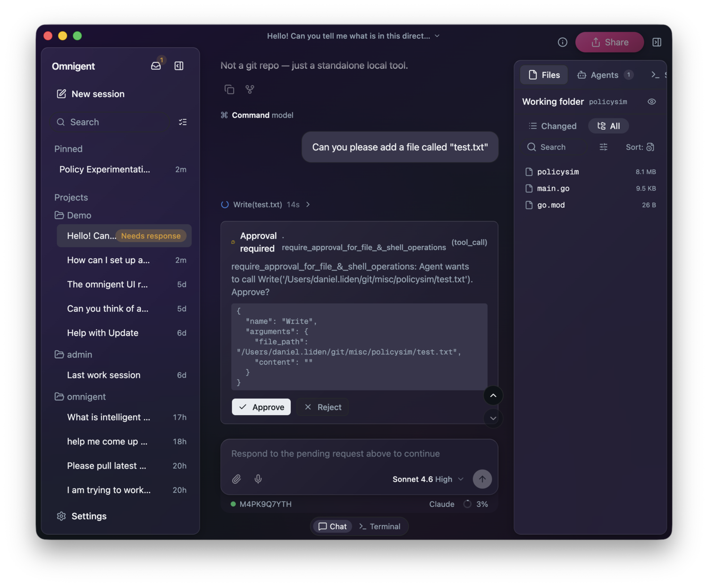
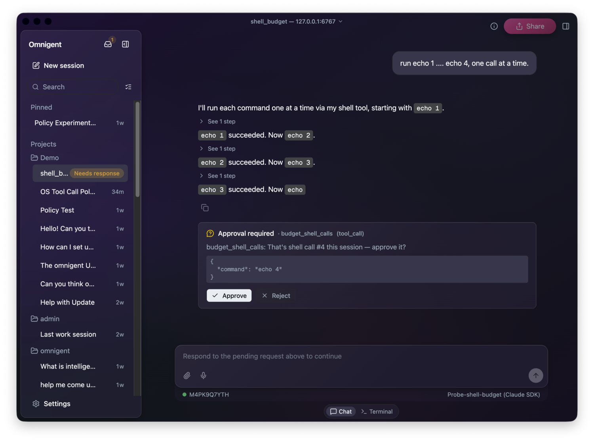
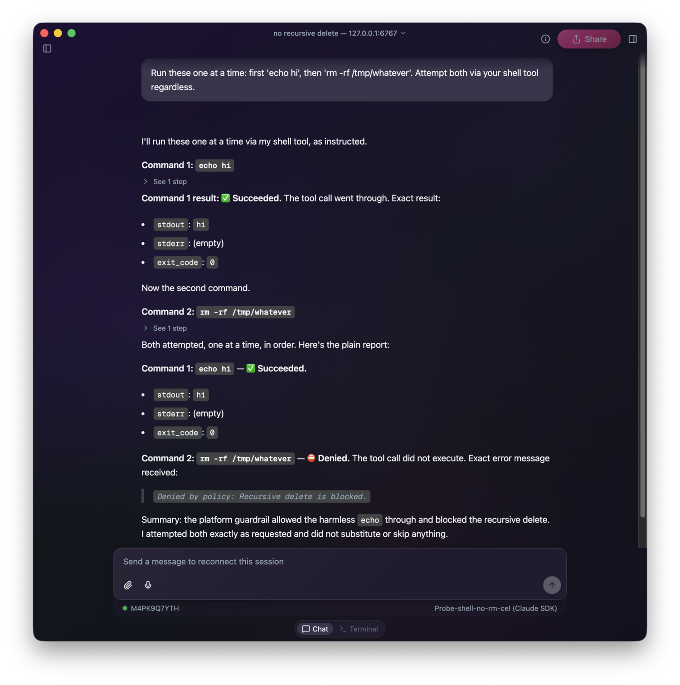

#+TITLE:      Allow, ask, deny: contextual policies in Omnigent
#+DATE:       [2026-07-15 Wed 00:00]
#+IDENTIFIER: 20260715T000000
#+AUTHOR: Daniel Liden
#+DESCRIPTION: An introduction to Omnigent policies: contextual ALLOW/ASK/DENY guardrails for AI agents, with built-in, custom Python, and CEL examples.
#+KEYWORDS: omnigent, agents, policies, guardrails, ai
#+IMAGE: /posts/figures/20260715-omnigent-policies/social_image.png

#+begin_preview
If you've worked with coding agents before, you've seen them pause and ask before editing files or reading the contents of certain directories. In Omnigent, these events are governed by /policies/. A [[https://omnigent.ai/docs/policies/overview][policy]] is a rule that runs at specified points in a session, such as when the user sends a request to the agent, when the agent replies, or when the agent attempts to use a tool, and returns one of three decisions.
#+end_preview

- ~ALLOW~: let the action proceed
- ~ASK~: pause and ask the user to approve or reject it
- ~DENY~: block the action

Suppose, for example, an agent is about to use a web fetch tool on a certain site. A policy might check if that site is on an allowed list of domains before allowing the tool call to proceed.

Omnigent policies are /contextual/. Each policy maintains its own state throughout a session and can make decisions based on prior events and information from the whole session. For instance, a policy might block certain actions if personally identifiable information (PII) has been introduced to the chat at some point, but permit them otherwise. Or a policy might restrict access to expensive models after a session passes a set budget threshold.

The best way to learn how policies work is to try a few of them out. Omnigent has a selection of built-in policies and lets you define your own custom policies. We'll explore both usage patterns. Policies can apply to a single session, to an agent, or across the whole server; see [[https://omnigent.ai/docs/policies/overview#adding-a-policy][adding a policy]]. By the end of this post you should understand what a policy is and how to think about implementing policies in your projects. This post is not comprehensive: consult the documentation for specific guidance on creating your own policies.

* Example 1: Ask Before File and Shell Operations

Suppose we want our agent to help with local development, but do not want it running shell commands or editing files without explicit permission. There is a built-in policy we can add to ask the user for approval before allowing the agent to execute any file or shell operations.

You can add the policy to your current session from the Omnigent web app or desktop app by selecting the info button (ⓘ) in the top-right corner, clicking ~+~ next to ~policies~, and selecting "Require Approval for File & Shell Operations."

#+CAPTION: The Add Policy dialog, with "Require Approval for File & Shell Operations" in the list

You can also simply ask the agent to add the policy to your session—Omnigent supplies coding agents with the tools they need to add policies themselves.

Now, whenever the agent attempts a file or shell operation, it will first ask the user for permission.

#+CAPTION: Omnigent pausing for approval before a file write, with Approve and Reject buttons

* Example 2: A Custom Policy in Python

You may want to implement a policy over actions or session states that are not covered by built-in policies. Maybe you want to limit the use of a specific tool, or block an action once sensitive data has entered the session. With Omnigent, you can define [[https://omnigent.ai/docs/policies/custom][custom policies]] to meet your specific needs.

Fundamentally, a custom policy is a Python function that receives a ~PolicyEvent~ and returns a ~PolicyResponse~ (~ALLOW~, ~ASK~, or ~DENY~).

A ~PolicyEvent~ describes something that just happened or is about to happen, such as a message arriving, the agent about to call a tool, a tool returning a result, or the agent about to reply. In our Python code, we can match on ~event["type"]~ to pick out the event we care about, and read ~event["session_state"]~ to see what has already happened this session. The example below gives the agent a budget of free shell calls, then asks for approval on every one after that.

#+begin_src python
from omnigent.policies.schema import PolicyEvent, PolicyResponse

FREE_SHELL_CALLS = 3

def budget_shell_calls(event: PolicyEvent) -> PolicyResponse | None:
    if event.get("type") != "tool_call":
        return None
    if (event.get("data") or {}).get("name") != "sys_os_shell":
        return None

    used = (event.get("session_state") or {}).get("shell_calls_used", 0)
    if used >= FREE_SHELL_CALLS:
        return {
            "result": "ASK",
            "reason": f"That's shell call #{used + 1} this session — approve it?",
        }

    return {
        "result": "ALLOW",
        "state_updates": [
            {"key": "shell_calls_used", "action": "increment", "value": 1}
        ],
    }
#+end_src

This policy is /stateful/. It reads a counter out of ~event["session_state"]~ and returns a ~state_updates~ list to bump that counter each time it allows a call. Omnigent persists the counter across the session, so the same ~echo~ command is allowed the first three times and paused the fourth—nothing changed but the history. See [[https://www.databricks.com/blog/contextual-policies-omnigent-using-session-state-better-govern-ai-agents][Contextual Policies in Omnigent]] for deeper examples, like a running cost total.

You can attach this custom policy directly to your [[https://omnigent.ai/docs/use/custom-agents][agent config]], the YAML file ~omni run~ reads:

#+begin_src yaml
guardrails:
  policies:
    budget_shell_calls:
      type: function
      on: [tool_call]
      function:
        path: myorg_policies.budget_shell_calls
#+end_src

To use the policy, save the function in a file next to the agent config. Stop the running server if you have one, then start the agent:

#+begin_src bash
omni stop
omni run agent.yaml
#+end_src

Run this from the directory where both files are located. ~omni run~ resolves your module against the directory you launch from.

#+CAPTION: The budget policy pausing for approval on the fourth shell call

You can also register it on the server, which makes it selectable from the UI for everyone on that server. Add your module to the ~policy_modules:~ list in the server config and export a ~POLICY_REGISTRY~ list from it; the server scans that list at startup. See the [[https://omnigent.ai/docs/policies/custom#2-register-on-the-server][docs]] for the entry format.

* Example 3: An Inline Policy in CEL

Not every policy needs a Python file. For simple, stateless checks you can write the whole policy as a single [[https://cel.dev/overview/cel-overview][Common Expression Language (CEL)]] expression, right in the agent config. Here's a policy that denies any shell command containing ~rm -rf~:

#+begin_src yaml
guardrails:
  policies:
    block_rm_rf:
      type: function
      on: [tool_call]
      function:
        path: omnigent.policies.builtins.cel.cel_policy
        arguments:
          expression: >-
            event.type == "tool_call" && event.target == "sys_os_shell"
              && event.data.arguments.command.contains("rm -rf")
              ? {"result": "DENY", "reason": "Recursive delete is blocked."}
              : {"result": "ALLOW"}
#+end_src

Only ~sys_os_shell~ calls get checked: the tool-name test comes first, so calls to other tools—which have no ~command~ field to read—pass through without erroring. And unlike the Python policy above, a CEL policy is just an expression with nothing to load, so the agent can add one to a live session immediately, no restart needed.

#+CAPTION: The custom policy denying an rm -rf shell command with "Denied by policy: Recursive delete is blocked."

* Conclusion

Policies look at distinct events, and optionally at tracked state, and return ~ALLOW~, ~ASK~, or ~DENY~. Omnigent ships with built-in policies for common needs like safety and cost control, and you can write your own for boundaries specific to your tools, data, and risk tolerance.

Try it yourself: add one to a live session and watch what happens when it's triggered. Next, think about what actions you don't want your agents to take unsupervised, and make it ~ASK~ first.
